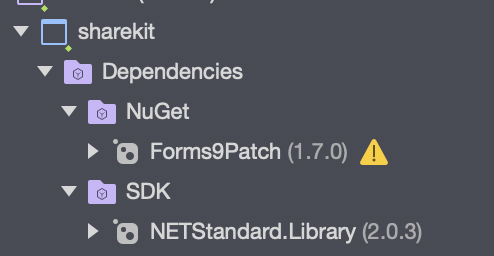
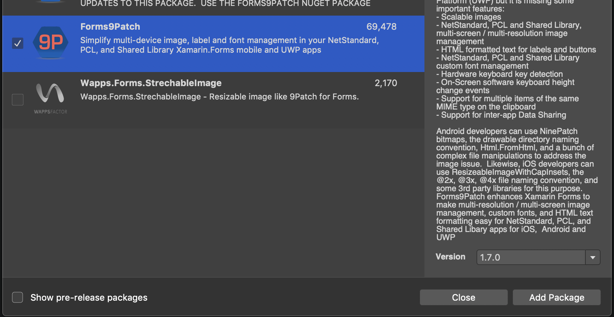
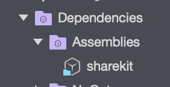

# Share Kit Xamarin

Xamarin implementation of [Share Kit](https://github.com/hellobloom/share-kit#readme)

# Building the Xamarin .NET Standard Library 

1. Open the `sharekit.sln` solution in any version of Visual Studio greater than or equal to 2019.
2. Make sure Visual Studio has restored the NuGet packages of Forms9Patch as shown below, this is very important otherwise the solution WON'T compile.



3. Once the NuGet packages have been restored and particularly the Forms9Patch pacakage, build the project and make sure its builds successfully and then navigate to the `sharekit` project folder, then go to the folders `bin -> Debug -> netstandard2.0` and you should find the library `sharekit.dll` ready for use in your xamarin project.

# Installing the library

1. First of all make sure your xamarin project is a `Xamarin.Forms` project and NOT a native iOS/Android project with a shared Xamarin/c# codebase, otherwise  you won't be able to use the library because after all the library is a Xamarin Library :).
2. Next add the `Forms9Patch` NuGet package to your project, this is also very IMPORTANT otherwise your project will fail to build/compile if this package is missing. 
	- You can do this by going to the Visual Studio menu and selecting `Project -> Add NuGet Packages..` and then search for `forms9patch` you should get a result as shown below, from there select the package and the click on `Add Package` to install it.
	
3. Once the `Forms9Patch` package has been added, add the above compiled library, by going to `Project -> Edit References` in Visual Studio. Then click on the `.Net Assembly` tab and then click on the browse button below and the navigate to the `sharekit.dll` library generated above and select it.
	- The library should now be shown under your dependencies in Visual Studio as follows
	
4. Finally setup the `Forms9Patch` library in the respective xamarin iOS and Android projects, by doing the following :_
	- For Android add the initialization statement `Forms9Patch.Droid.Settings.Initialize(this);` in the MainActivity.cs file between the lines `global::Xamarin.Forms.Forms.Init(this, savedInstanceState);` and `LoadApplication(new App());` as shown below

	```
	global::Xamarin.Forms.Forms.Init(this, savedInstanceState);
    Forms9Patch.Droid.Settings.Initialize(this);
    LoadApplication(new App());
	```
	- For iOS add the initialization statement `Forms9Patch.iOS.Settings.Initialize(this);` in the MainActivity.cs file between the lines `global::Xamarin.Forms.Forms.Init(this, savedInstanceState);` and `LoadApplication(new App());` as shown below

	```
	global::Xamarin.Forms.Forms.Init();
    Forms9Patch.iOS.Settings.Initialize(this);
    LoadApplication(new App());
	```
	- After doing this the library will now be ready for usage in your Xamarin project.

# Usage

To use the library in your project, simply add it as shown below, to any of your Xamarin pages which extend the `ContentPage` xamarin class i.e. `MainPage.xaml.cs`.

```
// set the request data
var requestData = new sharekit.RequestData
{
    action = sharekit.RequestData.Action_attestation,
    token = "0x8f31e48a585fd12ba58e70e03292cac712cbae39bc7eb980ec189aa88e24d043",
    url = "https://receive-kit.bloom.co/api/receive",
    org_logo_url = "https://bloom.co/images/notif/bloom-logo.png",
    org_name = "Bloom",
    org_usage_policy_url = "https://bloom.co/legal/terms",
    org_privacy_policy_url = "https://bloom.co/legal/privacy",
    types = new string[] { "full-name", "phone", "email" }
};

// set the callback url
var callBackUrl = "https://google.com";

// then intialize the button
var bloomButton = new sharekit.ShareKit().RequestButton(requestData, callBackUrl);

// set the layout padding
MainLayout.Padding = 5;

// finally add the verify button to the layout
MainLayout.Children.Add(bloomButton);
```
Also note the `MainLayout` here is the name I have given the `StackLayout` in my `MainPage.xaml` file, so it can be a different name depending on how you have named your layout.

Once you have built your Xamarin project and deploy it either in iOS or Android devices/emulators, the bloom verify button should now appear as shown below
- iOS

- Android


# Testing 

The sharekittest folder contains a solution for Visual Studio 2019 or greater that shows the library added and running as explained above.
